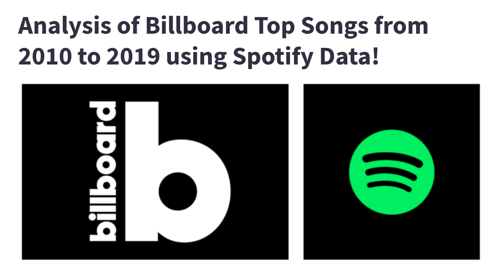

# Analysis of Billboard Top Songs from 2010 to 2019 using Spotify Data


<p align="center"></p>

* **Online URL**: https://cmu-ids-fall-2022-final-project-ids-team-apphome-aormdo.streamlit.app/
* **Team members**:
  * Liyan Chang (Contact Person: liyanc@andrew.cmu.edu)
  * Haoyu Qi (haoyuq)
  * Ran Ju (ranj)
  * Vrinda Jindal (vrindaj)
  * Tanvi Karandikar (tkarandi)
  
  
**Link to Paper**: https://github.com/CMU-IDS-Fall-2022/final-project-ids-team/blob/main/Report.md

**Link to Video**: https://drive.google.com/file/d/1WBZXsk8kMoBW9OenC28hTJSlLWpgW4k0/view?usp=sharing

**Running Instructions for Software**
```
cd app/
pip install -r requirements.txt
streamlit run Home.py
````

# Abstract

In this project we look at a dataset of the Top 50 Billboard songs from the years 2010 to 2019 and use Spotify's musical features to perform analysis. In particular, we look to answer three overarching questions:
1. Overall Popularity Analysis: What makes these songs popular?
2. Trends in Popular Songs: How has popularity changed over time?
3. Song Recommendations: Can we recommend similar songs from a given input?

## Work distribution

Team member | Work done
------ | ------
Liyan   | Introduction(report), Recommendation songs for users, edge map   
Haoyu   | Discussion + Future work(report), data cleaning, information extraction, API parsing 
Ran Ju  | Related Work(report), edge map, scatter plot, ridge line plot 
Vrinda | Methods + Results (report), Trend Analysis (drawing insights), Data Analysis, bubble plot, voilin plots, rec sys design
Tanvi    |  Methods + Results (report), application design, popularity Analysis (insights), bar plots, pie chart, video creation

## Project Phases
The Project was carried out in several well ideated and compartmentalized phases. A somewhat detailed flow of the process can be seen below:

<p></p>

