# Popular Song Data Analysis

**Project URL**: https://cmu-ids-fall-2022-final-project-ids-team-apphome-7k3ewy.streamlit.app/

**Video URL**: https://drive.google.com/file/d/1WBZXsk8kMoBW9OenC28hTJSlLWpgW4k0/view?usp=sharing

## Abstract

Music is functional as it can promote human well-being by tying to human social instincts. Studying popular music can bring into clear definition aspects of our lives and culture. For music producers, understanding the communities' tastes would help them explore on what makes a song popular. For music lovers, they could better understand their listening preferences and get the similar song recommendations based on their preferences. To achieve our goal of providing insights into the popular music for both music producers and music lovers, we aim to conduct a thorough analysis of the features of popular music and build a recommendation system for the music lovers. In detail, we conducted meticulous explorative data analysis for the musical features of the top popular songs on the billboard over years by visualizing their distributions by using the pie charts and histograms. This enable us to answer the question what features make the songs popular. In addition to that, we visualize the trends of the musical features over time by drawing parallel ridge line maps, area charts and line charts to understand how the musical features change over time and the evolution of the trend. In order to better provide insights of the personal musical preferences for music lovers, we visualize the similar songs based on the selected features and make some recommendations for them.

## Introduction
Music is a form of cultural expression. Popular music can been seen as a reflection of an era’s cultural identity. Through this project, we aim to carry out a deep dive analysis of popular music across eras through various data science techniques, answering questions like what makes songs popular and exploring how popular music has changed over the years, possibly making recommendations based on user’s preference. We believe such an analysis will not only be interesting from a cultural standpoint but will also be insightful for song creators - helping producers explore on what makes a song popular. Therefore, our targeted users mainly come from two groups, common song lovers who wants to get their personal recommendations, as well as song creators, who can benefit from our project by diving into which key aspects make a peice of song hot over several years, or even decades.

More specifically, in this project, we mainly work on three problems. Firstly, why are these songs popular and what features make them popular? To solve this problem, we decide to analyze on the dataset containing the popular songs on billboard over years. Then, we allow users to look closer to the distribution of the over charateristics as well as which artist occurs the most in these years, which generally gives users a taste of what are key aspects for song popularity. Secondly, we present to users our interpretation of how are popular songs change over time. To help both music producers and listeners get sense of the change of the trend over recent years, we provide an analysis of changes of features of popular songs over time. Users can select features they are interested in and we’ll visualize the trending genre, danceability and so on and users can observe some interesting patterns, specifically era-related. Finally, users are gifted with our powerful recommendation system. It offers music lovers to explore more and more songs of different genres and eras they may be fond of. The recommendation system consists of a network analysis, which computes the cosine similarity for songs with the same genre as the input query selected by users. Based on this network, several recommendations are made, while users can even toggle around the network and explore how these songs are related.

The rest of this report is organized as follows. We first discuss the related work with our project, from which we extend and get inspiration. Then, we talk in detail on the methods used for each visuals, following by a extensive analysis on the results and a discussion on some amazing insights. Finally, we conclude our report with remarks on future works.

## Related Work
Spotify is without a doubt one of the dominant music streaming platforms over the last few years with millions of users. With the increasing interest to Spotify, there more attempts to visualize the Spotify data. Most of the projects focus on exploring the user’s listening preferences and patterns by visualizing the user’s personal streaming history. In view of the popularity of Spotify data, many application programming interface and packages have been researched to better access the data and visualize the data.

​	As the goal of our project are provide insight of the music preferences and popularity patterns for both music producers and music lovers, we need two main techniques: pattern visualization and recommendation based on edge map.

​	Rshiny app [1] provides users a platform to help them self-explore their listening patterns and music personality based on Spotify and R. As accessing the users’ data without the consent of users and platforms is dangerous and may contain moral hazard, we borrow the idea from Rshiny app to visualize the pattern of top popular music. The author provides a sentiment analysis for the songs. The sentiments contain various attributes of music: ‘danceability’, ‘energy’, ‘loudness’, ‘speechness’, ‘liveness’, and ‘tempo’. A ridgeline chart[2] is used in the sentiment analysis. Ridgeline plots are very helpful when we want to visualize the distribution of categorical variable over time and space. It allows a number of data segments to be plotted on the same horizontal scale with the presentation with slight overlap. Ridgeline plot is ideal to visualize the pattern in the data as it works well to show the direct distribution patterns when there is a clear pattern in the results and it would get messy when there does not exist clear pattern and the groups tend to overlap each other too much [3]. Besides, it is also crucial to present collective sentiment to juedge the music personality. Inspired by the personality analysis [4]. The author from [1] choose two featrues he is interested in and draw a scatter plot based on the two features to get some insight into the music personalities. The example he provided is speechiness vs danceability. A high score of speechiness implies that the song is more wordy such as rap music or spoken word music with minimal instruments. Danceability describes how suitable a track for dancing based on a combination of musical elements including tempo, rhythm stability, beat strength and overall regularity [5]. A scatter plot is useful to observe and visaully discover the correlational relationship between the variables. The visualized relationship could be linear or non-linear, strong or weak, positive or negative [6].  

​	Algorithmic recommendations is now taking center stage in the music discovery landscape.Spotify itself employs several independent ML models and algorithms to generate item representations and user representations to build machine learning models for recommender systems. The representative of track is made up of two components: content-based filtering which evaluates the track by exploring the features of itself; colaborative filtering which takes advantage of user generated assets to build the connection between the track and other tracks on the platform. The original content-based filtering algorithm analyzed the artist-sourced metadata, the high-evel sonic characteristics of the track extracted from the raw audio signs, and semantic information from music-related text content with the utilization of Natural Language Processing modesl [7]. Collaborative filtering takes advantage of the so-called similarity score between the songs and users. There are mainly two ways to compute the similarity score. One is based on a massive user-item interaction matrix covering all users and tacks on the platform, which could be very expensive and time-consuming to mantain. And the other one is more efficient, which is based on a track's organizational similarity such as the two songs are put on the same playlist. As both user profiles and tack profiles are now accesible, Spotify use a recommender system with the reward system to select and generate the recommended playlist for the users. 

​	Explorify [8] is introduced as a visualization tool to achieve the functions of both exploring the uses' own music tastes by allowing the users to engage with their data. Explorify is user friendly as it assume that the audience do not have specific genre knowledge, audio features and it does not require the users to have expert knowledge in interpreting complex virtualizations. the centerpiece of explorify is the artist-genre network. through presenting this network, the authors wish to show the connection between the genre and artists. the authors choose to use an edge map to visualize the artist-genre network. a force-directed layout is employed to guarantee the interactivity and clarity of the nodes in the virtualization. color of a node is closely related with the polar coordinates in the edgemap. edge connects two nodes and the relationship represented by the edges is commutative. the lable of the artist is hovered at the top of the node and it can be hidden in the generated virtualization. edgemap which visually presenting a network of connecting entities builds a node-link model. it is intuitive, flexible, fast and insightful by allowing users to gain deeper knowledge, undersgtand the context and finding something they are interested in by diving into the map.   

​	refering to the similarity score, the similarity metrics can be divided into two groups: similarity based metrics and distance based metrics. the first category determine the most similar objects with the highest values. the commonly used metrics are pearson's correlation coefficient which is a measure related to the strength and direction of a linear relationship; spearman's correlation which uses the rank of each value; kendall's tau which is quite similar to spearman's correlation; cosine similarity calculates the consine of the angle between two vectors; while jaccard similaroty compares two binary vectors. on the other hand, the distance based methods choose the most similar objects by prioritizing objects with lowest values. the most common method is using euclidean distance which is also called straight-line distance between two vectors. the other one is manhattan distance which is also know as 'cityblock'.

# methods and results

the aim of this project was to do a deep-dive data science analysis of popular songs from the 2000s. the project was ideated to take place in a couple of streamlined well chalked-out phases. 

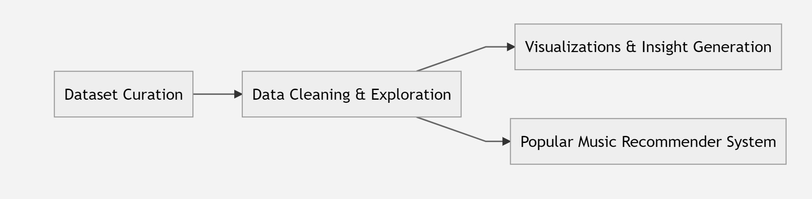

## datasets
 1. [spotify million playlist dataset](https://www.aicrowd.com/challenges/spotify-million-playlist-dataset-challenge)
 the spotify million playlist datasets, as the name suggests has spotify songs belonging to 1 million playlists that listeners have created on the spotify. 
2. [spotify api](https://developer.spotify.com/documentation/web-api/)
the official api exposed by spotify which allows to query for songs based on a variety of parameters like playlists, popularity, ranking etc. 

the [million playlist dataset](https://www.aicrowd.com/challenges/spotify-million-playlist-dataset-challenge) and the [spotify api](https://developer.spotify.com/documentation/web-api/) where the main inspirations for the project for us as combied they gave access to a very big repository of songs with rich features associated with each data.  

for our project, we decided to concentrate our focus on a smaller subset of spotify songs - the ones that have had high popularity over the years. we define popularity by songs which have been on the [billboard top 50](https://www.billboard.com/) for each year. our analysis is limited to the songs from years which have been relevant to us (the team-members) i.e. songs from the last decade - 2010 to 2020. 

the idea was to scrap this data using the billboard lists and the spotify api, but on more exploration, we found this data set already existed: [spotify top 50 songs by year](https://www.kaggle.com/datasets/leonardopena/top-spotify-songs-from-20102019-by-year). since this dataset is not an official dataset, we did a manual inspection of the dataset and matched entries with the billboard charts of the years - they were accurate. 

### intial data exploration and data cleaning
as described above, the datset we used finally is the [spotify top 50 songs by year](https://www.kaggle.com/datasets/leonardopena/top-spotify-songs-from-20102019-by-year). since this data has been scrapped programatically from the spotify api, the records are very well structured and are almost complete. 

- intial analysis: as stated above since the data was aggregated using the spotify api, it very clean to begin with. there were no out-of-bounds values or wrong values. for all the musical features e.g. loudness, danceability, acousticness, valence, speachiness etc, the values lied within the expected ranges. 
- null/missing values: there were not a lot of null/missing values in the dataset. if major values like artist name, song name, year was missing the records were simply dropped. for the musical features, they were replaced with placeholder average values. 
- coarse-grained aggregation of genres: since the user focus of our application are lay-men like the teammates, we manually classified the genres into big buckets for more understandability and genrality. e.g. edm and electronic trap have been clubbed together as "electro". detroit hip-hop, canadian hip-hop and australian hip-hop have been simply called "hip-hop". some more details can be seen in the datacleaning jupyter notebook in the repository a snippet of which is shown below.
     todo: add image of clubber

### dataset features
for each song in the datset, along with the expected features like artist name, year, song name etc, there are also curated musical features, e.g. danceability, acousticness, speachiness, valency etc. all these music features have been created by (experts at) spotify and they scale from a range of 0 to 100, where a higher value indicates higher prevelance of that feature in the song. moreover the distributions of these values were also similar so that using them together (as if they are on the same scale) for the purporse of analysis did not seem far fetched. 

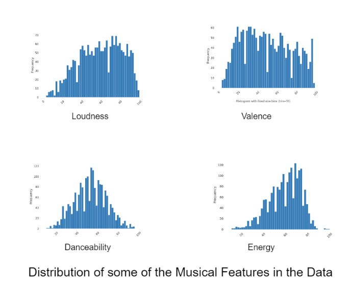

## visualizations 
in our project we sought to answer two main questions:
- what makes songs popular?
- how have popular songs changed over time.

along with this, we aimed at creating creating a recommender system model to recommend music to listners, leaners and creators. some fun and interesting insights that we came across and observed that we wanted to share are elaborated upon below:

### popular songs galore!!!
since our dataset is a combination of top charts over the years, it basically only consists of songs that can be classified as being popular. for instance, the mean of the popularity score is 69! from the distribution of the popularity score of songs in the dataset it can be clearly seen that the bell curve has a clear right shift to it. 

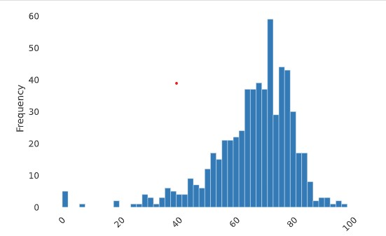

<figcaption>popularity score distribution</figcaption>

### everybody loves to dance??
 we used a variety of plots to analyse the distributions of these popular songs. naturally the first classification of songs is based on the genre. we display the aggregate number of popular songs that belong to each genre. this distribution can also be seen on a per-year basis in the application. across all the years, "dance pop" songs are the seem to be the most popular across all the years. more than 50% of the popular songs over the past 10 years were dance pop songs. 

todo: insert bar + pie chart

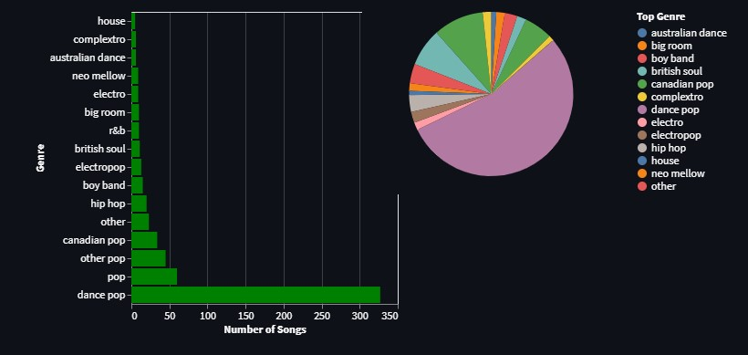

<figcaption>dance pop is really popular</figcaption>

if we do a similar analysis about the genre wise distribution of popular songs, but see how the trends have changed over time, we see that even though dance pop songs still form the majority class, their popularity over time is decreasing. the popularity of general pop songs - taylor swift, maroon 5 etc - increased. 

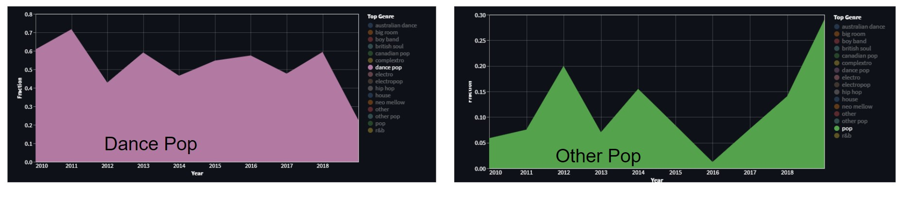

<figcaption>dance pop became less popular, whereas other pop became more popular</figcaption>

the high popularity of pop songs can also be corroborated by the fact that the danceability distribution of popular songs remains high constantly over the years. interestingly, though the danceability of popular songs remains high over the years, it is just pop dance songs that make the majority in the 2010s and not other dance genres like hip-hop etc. 

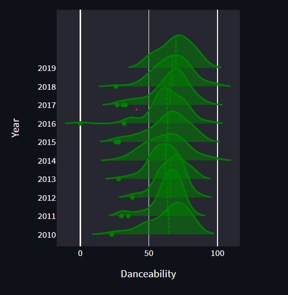

### only one formula for popular songs??
As emphasized upon above, our dataset only consists of popular songs of the 2010s. interestingly enough, the musical features of these popular songs remains more or less constant over genres and years. this inference is clear from the plot below as the musical features values for the songs for nearly constant lines and do not change with years leading us to maybe conclude that there is a fixed formula for creating a popular song. this observation along with the insight drawn above leads us to believe that maybe the musical preferences of the world have not changed a lot over the years. 

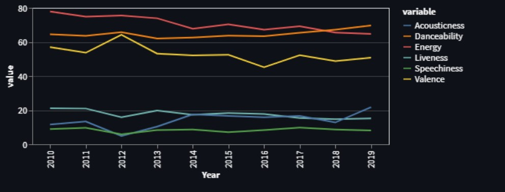

 <figcaption> musical features of popular songs remains same</figcaption>

this insight naturally led us to ask a subsequent question:

 does the formula for creating popular songs changes with the genre? 

From the bubble plots below, we can see that there is some variation in musical features with genres but overall the features do follow some common trends. E.g. Most popular songs have high danceability, high beats per minute (BMP) and average loudness. 

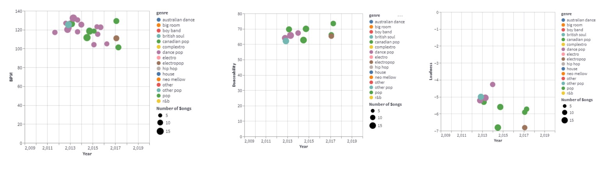

This leads us to the conclusion that the formula for popular songs in the 2010s has remained somewhat constant though the genre of songs does bring in some variability. As data scientist in the making, the subsequent question that seems intersting to us is to inspect if there are any underlying hidden confounders that lead change with popular songs over the years. We propose this as one of the future works. 

### SOME FUN TRIVIA!!!
All five team members for this project are non-native english speakers. Meaning that we do not listen to egnlish music a lot, but are aware of the general American/English pop culture due to its overwhelming presence on social media. So for us it was interesting to see how most of the popular music of the past decade comes from most popular personalities - (popular music makers being famous personalities is not common in many cultures like Bollywood (India). ). So to do such an analysis we decided to extend the application to do an analysis about the artists of popular music.

We realised that our app can be used to form many general trivia questions! A welcome suprise to us as we had not initially intended for it!!  Some intersting trivia:

- Katy Perry and Justin Bieber have had the most number of popular songs in the last decades. 
- Cari B creates the most danceable songs (who knew!!) - but only according to spotify's danceability analysis XD
- Calvin Harris makes really loud songs
- Long songs are created by Justin Timberlake, Beyonce and Adele

Though these trivia insights might be very natural for an English speaker, they are pretty intersting and novel for non-native english speakers like us.

## Recommender System
As data science students, to us, the natural logical conclusion for this song based data-science project seemed to be to have a song recommender system. The target of this functionality is for users to get song recommendations of similar songs based on songs that they already like. 

The user is able to input a song of their choice, and our model gives them recommendations of newer songs that are similar to the input song. To make the recommender system more useful and task specific, we also provide the user with the option to specify any number of musical features based on whose similarity the recommendations are required. This functionality has a wide variety of applications, like choosing dance music for a party, getting inspiration for music production etc. 

### The Model
Our model is a modification of the classical [K-Nearest Neighbour model](https://en.wikipedia.org/wiki/K-nearest_neighbors_algorithm). Our modification is based on the similarity scores which have been described the related work section of this report. We have set the value of k as 5. 

We only consider the features that have been specified by the user. Since all the musical features provided (e.g. Danceability, Energy, Speachiness etc) have the same scale and intuitive distributions (as described in the section above), it is acceptable to compare/use them together. Our similarity score is the cosine simiarity score. For a given song, the 5 songs which have the highest similarity score with it are output as the recommendations. The cosine similarity between two songs (A,B) is defined as follows (Image Courtesy: Wikipedia)

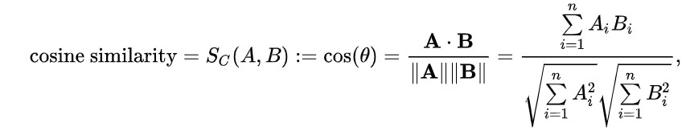

Aside: Before exploring about cosine similarity, we had planned on using inverse of distance between the two songs in the feature space as as our similarity score. But after exploring some related works, we decided to use cosine similarity as it is more widely used, more widely accepted and a community standard.

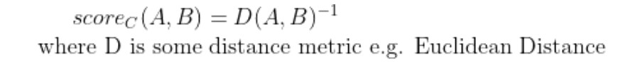

Now we show an example of our recommender system. Here the song chosen is "You've Got a Friend" and we want recommendations on the basis of Danceability, popularity, Acousticness and Speachiness for this song.

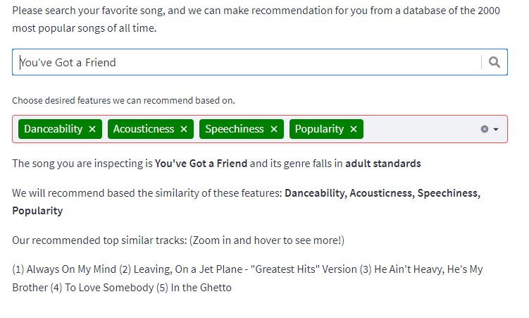

We also display an edge-map of the songs in the chosen feature space to give a visualization of song similarities. This gives an intution of similarity between songs. A sample is shown below. The year of the popular song is indicated by the color of the node. 

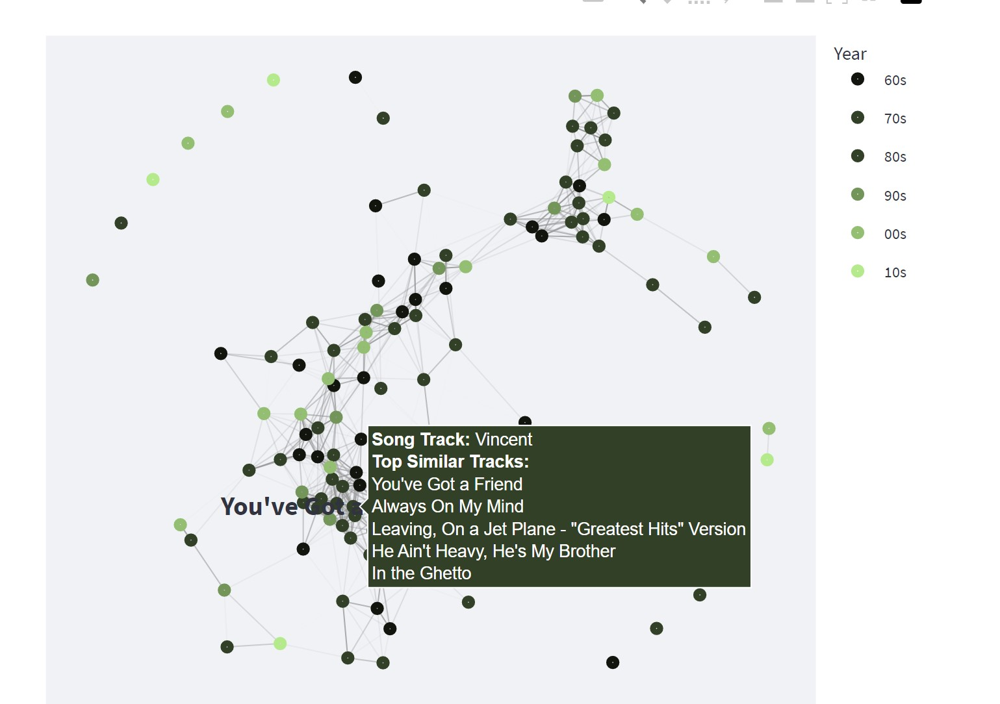

# Discussion

In order for audience to be informed while developing their own works, our initiative strives to provide them insights on the characteristics of heat songs. The audiences may also observe how the various elements of these popular songs evolve over time. We provide viewers two options, including the genre and the feature they are most interested in. They can monitor trends for their chosen characteristic in popular songs of a certain genre. One may observe, for instance, that dance pop music's distribution of danceability was considerably more concentrated in the 1960s than it is today. With the knowledge, one may modify the danceability of the dance music to fluctuate within that range if one wishes to produce vintage dance pop music that imitates the songs of the 1960s. The audience may also learn the current trend of one particular music genre through the distribution chart. He could also note that the volume of current hot dance pop music is getting louder and louder, giving him ideas for his future works.

​	Our approach also shows the audience how songs of a particular genre are related to one another, and the computation of similarity is dependent on the attribute that the audience has chosen. Additionally, by displaying these songs on an edge map, audiences may click on particular nodes to get more information about these songs and the songs that are most comparable to them. If audiences are curious about these songs' features and connections, they may then go deeper into them. Additionally, viewers may observe the variation in similarity for the same songs based on various factors. Besides, Audiences can only focus on connections between heat songs in specific time period and learn insights from their interested heat songs.

​	For particular genres, we additionally illustrate the link between several traits. The link between these aspects in popular songs from various years can be referred to by audiences when deciding on their preferred features for their future work. For instance, if they intend to produce adult standards music, they may see from the chart that as energy rises, acousticness falls, necessitating a trade-off between these two aspects.

​	There are still some shortcomings in our current design and areas that can be improved. Our product has undergone some user-friendliness testing, and based on user feedback, the navigation bar on the leftside is a little bit misleading. Users may be confused when provided access to the handlers for other interactive charts on the main page since they are not controlled by the leftside inputs. Additionally, some users have commented that they like to switch the arrangement so that the first and third charts are combined, allowing them to gain insights into both the connection between two characteristics and the variation of their distribution.

​	In addition to advances in user engagement, our approach has some inherent drawbacks. The majority of our visualizations, including song connections, feature connections, and so forth, are based on certain genres. There are, nevertheless, linkages between songs of many genres. For example, audiences may want to know how popular songs of different decades are related with each other. And the link between songs or characteristics for various genres cannot be seen in our present design.

# Future Work
​	Our study presents statistics on the top 2000 songs from 1959 to 2019, which provides some insights into the characteristics of these songs based on various genres. In reality, it's possible that audiences desire to examine the characteristics of famous songs as well as compare them to less well-liked songs and draw lessons from the latter. In future study, it could be necessary to increase the amount of data in order to compare songs with comparable qualities but different commercial outcomes, as well as to show consumers the similarities between successful songs.  

​	In our current design, we provide users with plots showing the change of popular songs over time. However, these changes are not that obvious, and in some time period, the formula of popular songs seems to remain constant. In the next study, we as data scientists hope to delve further into the variants of popular songs by extracting additional hidden knowledge.  

​	Regarding the recommendation part, we now provide users with an edgemap showing the links between existing popular songs according to their inputs. In the future, we can connect multiple users together and analyze their interests and demonstrating the recommendation map based on methods like colaborative filtering. 

​	Apart from the dataset about popular songs, we can also reference the powerful spotify api, as it provides millions of songs along with their side information. We can take the advantage of data from spotify api to further analyze user-created playlists, albums, track version, followers and so on. 

# Reference
[1] Barlas, A. (2021, November 29). Combining Spotify and R - an interactive Rshiny app + spotify dashboard tutorial. Medium. Retrieved December 6, 2022, from https://towardsdatascience.com/combining-spotify-and-r-an-interactive-rshiny-app-spotify-dashboard-tutorial-af48104cb6e9 

[2] Holtz, Y. (n.d.). Ridgeline Chart. the R Graph Gallery. Retrieved December 6, 2022, from https://r-graph-gallery.com/ridgeline-plot.html 

[3] Healy, Y. H. and C. (n.d.). Ridgeline plot. Ridgeline plot – from Data to Viz. Retrieved December 6, 2022, from https://www.data-to-viz.com/graph/ridgeline.html 

[4] Pham, J. (2021, October 4). Spotify personal data analysis. Medium. Retrieved December 6, 2022, from https://medium.com/@joypham7/spotify-personal-data-analysis-858c8fbe6983 

[5] Patients choose music with high energy, danceability, and lyrics in ... (n.d.). Retrieved December 6, 2022, from https://journals.sagepub.com/doi/10.1177/0305735620907155 

[6] Scatter plot. Corporate Finance Institute. (2022, November 5). Retrieved December 6, 2022, from https://corporatefinanceinstitute.com/resources/data-science/scatter-plot/ 

[7] How Spotify's algorithm works? A Complete Guide to spotify recommendation system [2022]: Music tomorrow blog. How Spotify's Algorithm Works? A Complete Guide to Spotify Recommendation System [2022] | Music Tomorrow Blog. (n.d.). Retrieved December 6, 2022, from https://www.music-tomorrow.com/blog/how-spotify-recommendation-system-works-a-complete-guide-2022#:~:text=%22We%20can%20understand%20songs%20to,recommend%20song%20Z%20to%20them. 

[8] Ivanova, I., &amp; Engstad, J. (n.d.). Explorify: A Personalized Interactive Visualization Tool for Spotify Listening History. CPSC 547: Information visualization, Sep 2021. Retrieved December 6, 2022, from https://www.cs.ubc.ca/~tmm/courses/547-21/ 
